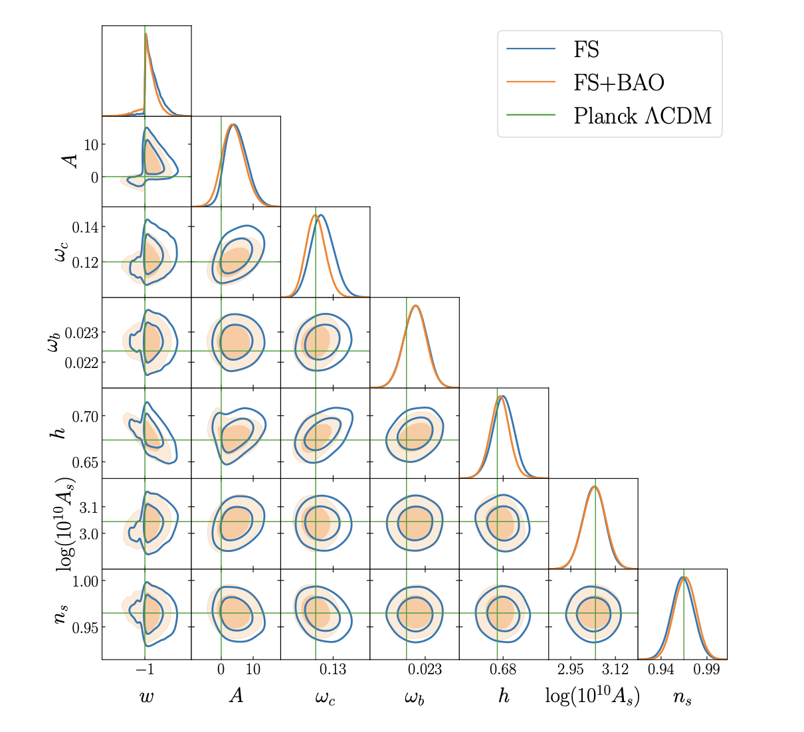

We analyse the BOSS DR12 multipoles of the galaxy power spectrum jointly with measurements of the BAO scale for three different models of dark energy. We use recent measurements performed with a windowless estimator, and an independent and fast pipeline based on EFTofLSS modelling implemented via the FAST-PT algorithm to compute the integrals of the redshift-space loop corrections. We accelerate our analysis further by using the bacco linear power spectrum emulator instead of a Boltzmann solver. We perform two sets of analyses: one including Planck priors, and another that is fully CMB-free. The first model we study is LCDM, within which we reproduce previous results obtained with the same estimator. We find a low value of the scalar amplitude in the CMB-free case, in agreement with many previous analyses of the BOSS data. We then study wCDM and the dark scattering model of interacting dark energy, which we label wACDM. We manage to constrain A for the very first time (using Planck priors on the primordial parameters). Our analysis can be used as a guide for the analysis of any model with scale-independent growth. Finally, we study the dependence of the results on the priors imposed on the nuisance parameters and find these priors to be informative, with their broadening generating shifts in the contours. We argue for an in depth study of this issue, which can affect current and forthcoming analyses of LSS data.

