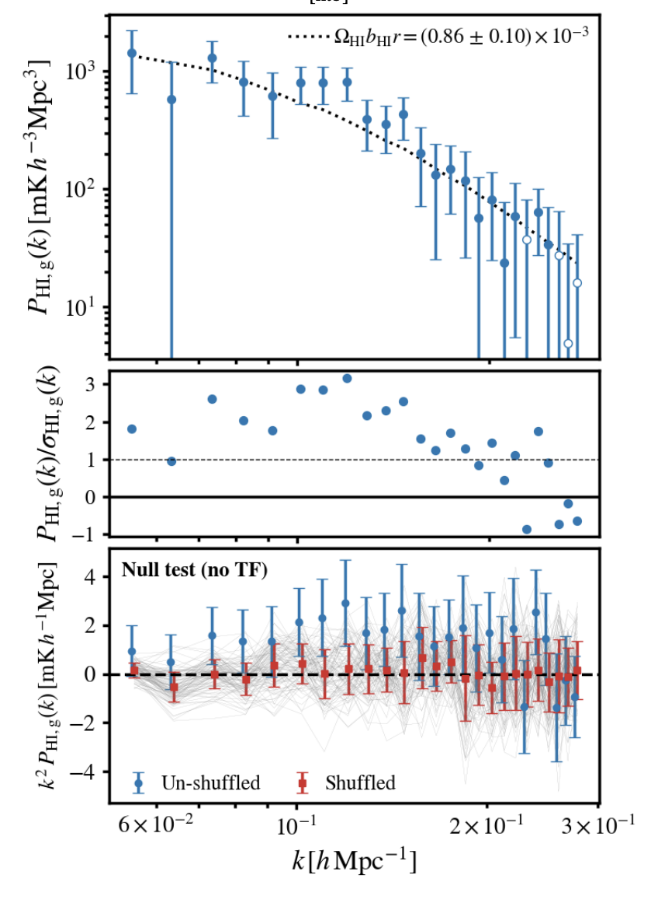

Exciting news for MeerKAT intensity mapping! We presented a detection of correlated clustering between MeerKAT radio intensity maps and galaxies from the WiggleZ Dark Energy Survey. This detection is the first practical demonstration of the multi-dish auto-correlation intensity mapping technique for cosmology. This marks an important milestone in the roadmap for the cosmology science case with the full SKAO.

The [paper has been posted on the arXiv](https://arxiv.org/abs/2206.01579) and was led by our previous team member Steve Cunnington (now in Manchester University).

