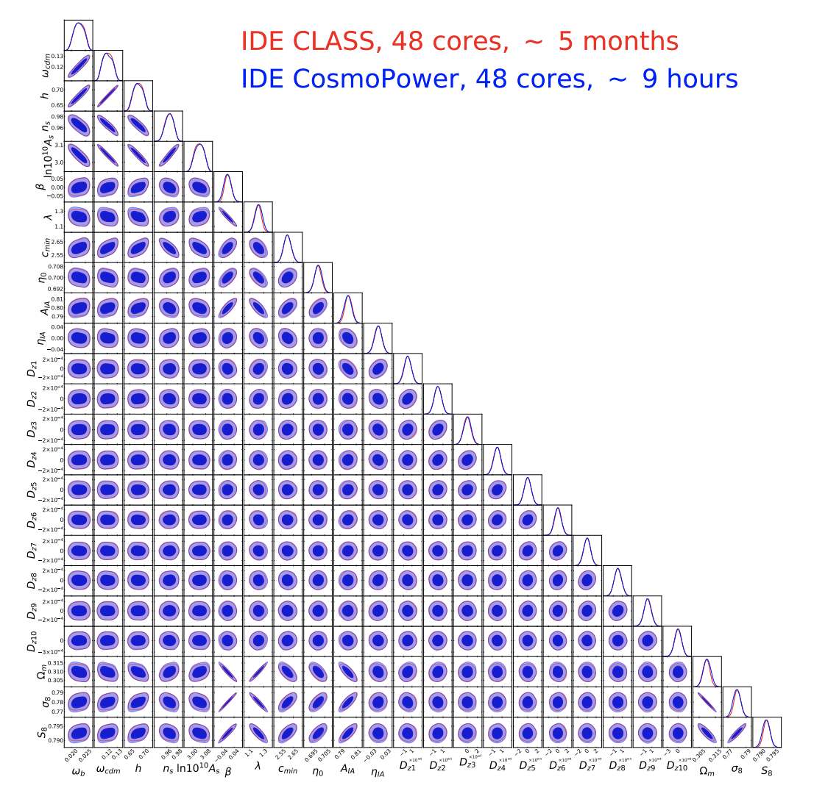

[New paper](https://arxiv.org/abs/2110.07587) with Alessio Spurio-Mancini, and [2-min summary video](https://www.youtube.com/watch?v=c2x8hzApAgE).

We derive constraints on a coupled quintessence model with pure momentum exchange from the public ∼1000 deg2 cosmic shear measurements from the Kilo-Degree Survey and the Planck 2018 Cosmic Microwave Background data. We accelerate parameter estimation by sourcing cosmological power spectra from the neural network emulator CosmoPower.  We also provide MCMC forecasts for a *Euclid*-like survey: the contours are obtained in a few hours with CosmoPower, as opposed to the few months required with a Boltzmann code!

