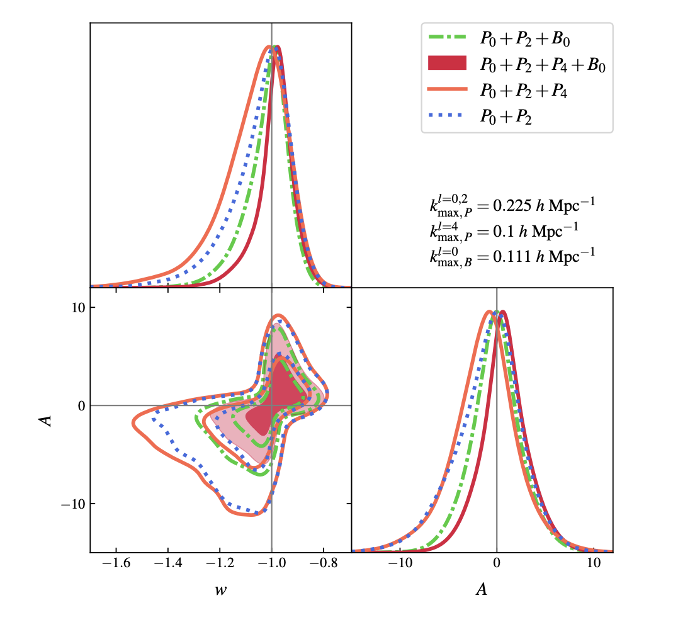

# Interacting dark energy from the joint analysis of the power spectrum and bispectrum multipoles with the EFTofLSS

<https://arxiv.org/abs/2207.13011>

We focus on a phenomenologically interesting class of dark scattering models that is characterised by pure momentum exchange between dark energy and dark matter. This model extends the parameter space with respect to LCDM by two parameters, w and A, which define the dark energy equation of state and the strength of the coupling between dark energy and dark matter, respectively. In order to test non-standard cosmologies with Stage-IV galaxy clustering surveys, it is crucial to model mildly nonlinear scales and perform precision vs accuracy tests. We use the Effective Field Theory of Large-Scale Structure, and we perform validation tests by means of an MCMC analysis using a large set of N-body simulations. We find that adding the bispectrum monopole to the power spectrum multipoles improves the constraints on the dark energy parameters by 30%.

