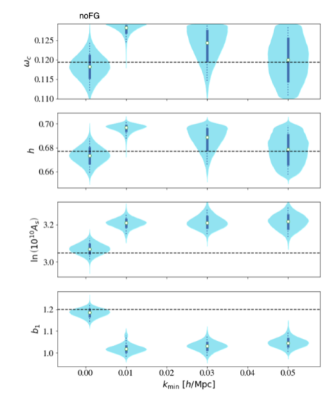

In [https://arxiv.org/abs/2206.14727](https://t.co/0e9d5xPNLV) I am using 1-loop perturbation theory with counter terms to model the mildly nonlinear scales for HI intensity mapping and run trustworthy, conservative "full shape" MCMC forecasts. I vary 3 cosmological and 7 nuisance parameters, and I contaminate the mock data vector (the HI power spectrum multipoles) with simulated signal loss from 21cm foreground removal. Precision vs accuracy results are worrying, more than 5σ biases ... but k_min cuts can help with "debiasing" omega_c and h (but not A_s and b_1).

