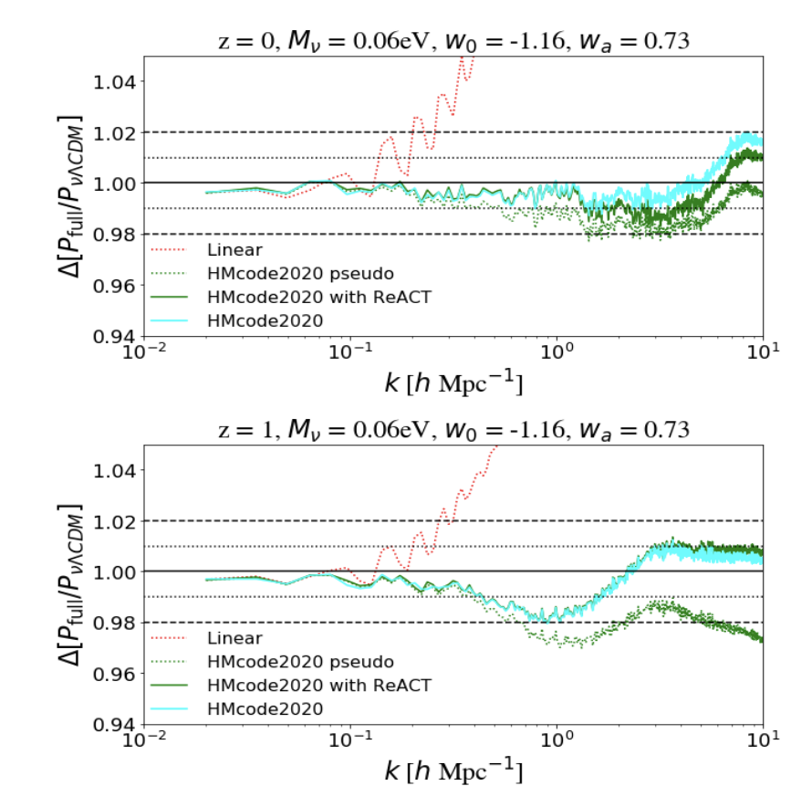

We present the first non-linear, theoretically general means of accurately including massive neutrinos for beyond-ΛCDM cosmologies, which further suggests that baryonic, massive neutrino and dark energy physics can be reliably modelled independently. The paper has been accepted for publication in MNRAS.

