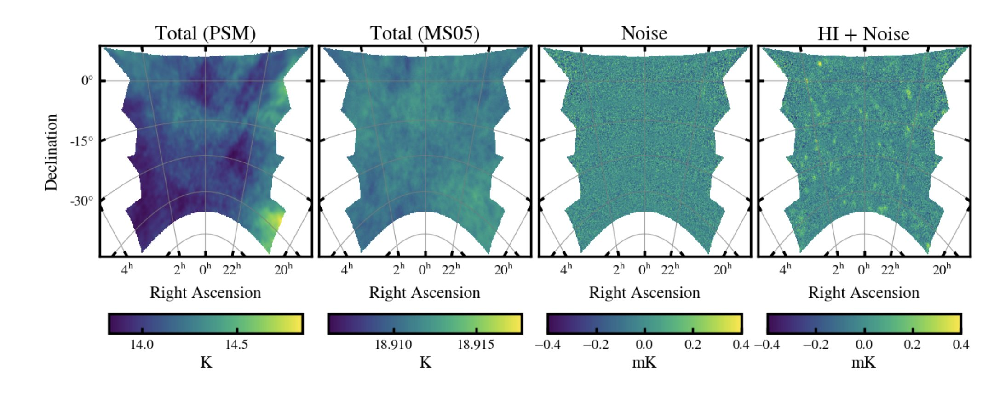

Steve Cunnington has helped perform the first blind foreground subtraction challenge for neutral hydrogen intensity mapping with MeerKAT and the SKA, using state-of-the-art simulations. The paper has been posted on the arXiv.

