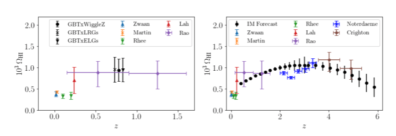

On September 9th I gave a talk at the[ Cosmic DAWN Center](https://dawn.nbi.ku.dk/) at the University of Copenhagen. I talked about neutral hydrogen intensity mapping and how we can use it to probe galaxy evolution. I also presented our latest data analysis [paper](https://arxiv.org/abs/2102.04946) using intensity maps from the Green Bank Telescope and overlapping eBOSS galaxy samples.

