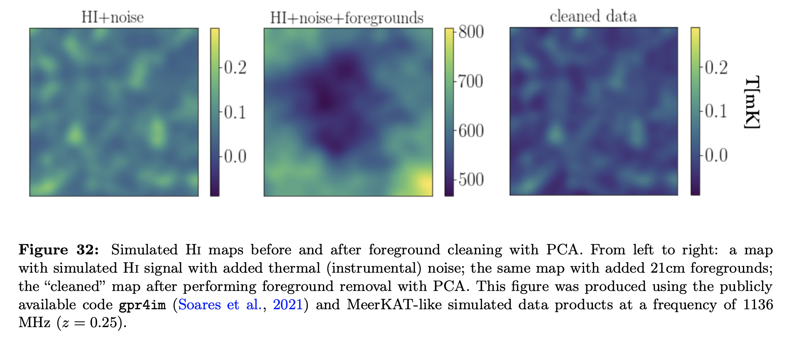

I have written the HI intensity mapping chapter in the recent review of emerging cosmological probes. I hope it is pedagogical and useful for the wider community. Most of the figures were produced using publicly availlable codes. 

